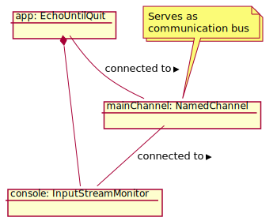

Console Echo
============

Console Echo is a slightly more complicated application that
uses two components. One component is the 
[InputStreamMonitor](latest-release/javadoc/index.html?org/jgrapes/io/InputStreamMonitor.html) from the framework,
the other implements the application logic of this example.

```java
public class EchoUntilQuit extends Component {

    @Handler
    public void onInput(Input<ByteBuffer> event) {
        String data = Charset.defaultCharset().decode(event.data()).toString();
        System.out.print(data);
        if (data.trim().equals("QUIT")) {
            fire (new Stop());
        }
    }
}
```

Component `EchoUntilQuit` handles
[Input](latest-release/javadoc/index.html?org/jgrapes/io/events/Input.html)
events. Input events carry data that has been received from "outside"
the application. I/O data is represented using buffers from the Java 
[NIO package](https://docs.oracle.com/javase/8/docs/api/index.html?java/nio/package-summary.html).

Once the data has been retrieved from the event, it is written to the 
console. Then the handler checks if the line entered was "`QUIT`". If this 
is the case it fires a `Stop` event on the channel used by the application,
which causes the application to terminate.

The two components are created and "connected" in a `main` method.

```java
    public static void main(String[] args) throws InterruptedException {
        EchoUntilQuit app = new EchoUntilQuit();
        app.attach(new InputStreamMonitor(app.channel(), System.in));
        Components.start(app);
        Components.awaitExhaustion();
        System.exit(0);
    }
```




*ToDo*

---
