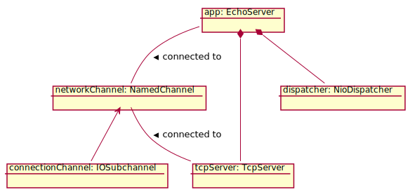

TCP Echo Server
===============



```java
public class EchoServer extends Component {

    public EchoServer() throws IOException {
        super();
        attach(new NioDispatcher());
        attach(new TcpServer(this).setServerAddress(
            new InetSocketAddress(8888)).setBufferSize(120000));
    }

    @Handler
    public void onRead(Input<ByteBuffer> event)
            throws InterruptedException {
        for (IOSubchannel channel : event.channels(IOSubchannel.class)) {
            ManagedBuffer<ByteBuffer> out = channel.byteBufferPool().acquire();
            out.backingBuffer().put(event.buffer().backingBuffer());
            channel.respond(Output.fromSink(out, event.isEndOfRecord()));
        }
    }

    public static void main(String[] args) {
        try {
            EchoServer app = new EchoServer();
            Components.start(app);
            Components.awaitExhaustion();
        } catch (InterruptedException | IOException e) {
            e.printStackTrace();
        }
    }
}
```

*To be completed*