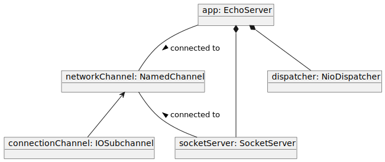

TCP Echo Server
===============



```java
public class EchoServer extends Component {

    public EchoServer(Channel componentChannel) throws IOException {
        super(componentChannel);
    }

    @Handler
    public void onRead(Input<ByteBuffer> event)
            throws InterruptedException {
        for (IOSubchannel channel : event.channels(IOSubchannel.class)) {
            ManagedBuffer<ByteBuffer> out = channel.byteBufferPool().acquire();
            out.backingBuffer().put(event.buffer().backingBuffer());
            channel.respond(Output.fromSink(out, event.isEndOfRecord()));
        }
    }

    public static void main(String[] args)
            throws IOException, InterruptedException {
        Channel networkChannel = new NamedChannel("network i/o");
        Component app = new EchoServer(networkChannel)
            .attach(new NioDispatcher())
            .attach(new TcpServer(networkChannel).setServerAddress(
                new InetSocketAddress(8888)).setBufferSize(120000));
        Components.start(app);
        Components.awaitExhaustion();
    }
}
```

*To be completed*