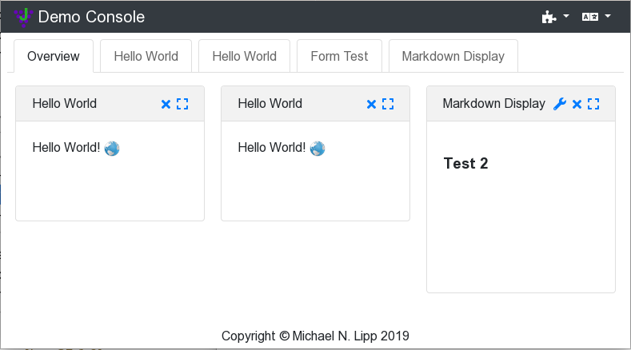

A JGrapes Web Console is a single page application (SPA) provided by
several components from the JGrapes framework. The design
is highly modular and allows the adaption of the web console to 
different purposes.

(A live [demo configuration](https://jgrapes-console-demo.herokuapp.com/)
of the portal is available at [heroku](https://www.heroku.com/).)

A JGrapes Web Console consists &mdash;from the user's point of view&mdash; 
of a fixed frame with configurable content. The frame provides some 
means to add content (typically by using a dropdown menu) and to 
configure global settings  such as the locale.

The content of the frame is provided by web console display components 
or "conlets" for short. These components typically support a summary
or preview display that can be put on an overview panel in a dashboard
style and a large view that is supposed to fill the complete frame.

Tabs or a menu in a side bar can be used to switch between
the overview panel(s) and the large views of the different conlets. 

The architecture of the web console could roughly be classified as a 
micro service driven micro frontend (with run-time integration via 
JavaScript), though it favors a common approach to styling for all 
components, which is unusual for most micro frontend architectures.

The [Javadoc](javadoc-webconsole/index.html) explains the architecture
in detail and provides you with the information required to build
your own console and components.

