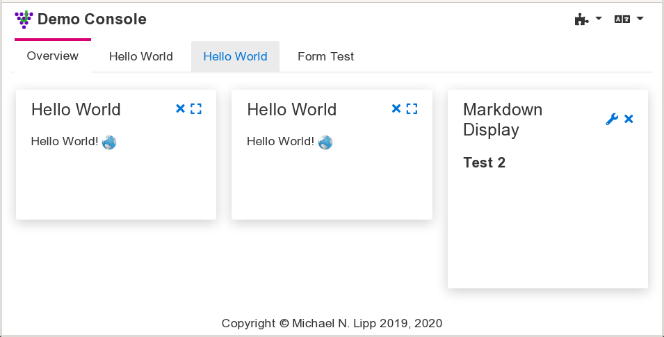

# Overview

The server side of the web console consists of several JGrapes components
that drive a single page application (SPA) on the server. The design
is highly modular and allows the adaption of the web console to 
different purposes.

A JGrapes Web Console consists &mdash;from the user's point of view&mdash; 
of a fixed frame with configurable content. The frame provides some 
means to add content (typically by using a dropdown menu) and to 
configure global settings  such as the locale.

The content of the frame is provided by web console display components 
or "conlets" for short. These components typically support a summary
or preview display that can be put on an overview panel in a dashboard
style and a large view that is supposed to fill the complete frame.

Tabs or a menu in a side bar can be used to switch between
the overview panel(s) and the large views of the different conlets. 

The architecture of the server side is explained in detail in the
[package description of the base component](http://127.0.0.1:4000/javadoc-webconsole/org/jgrapes/webconsole/base/package-summary.html#package.description).
The additional information provided here focuses on the SPA 
in the browser and on how to build your own console and additional conlets.

# SPA Frame

The SPA frame is provided by a class derived from 
[`ConsoleWeblet`](javadoc-webconsole/index.html?org/jgrapes/webconsole/base/ConsoleWeblet.html).
If you like (or can live with) the [Freemarker](https://freemarker.apache.org/)
template engine, you should use
[`FreeMarkerConsoleWeblet`](javadoc-webconsole/index.html?org/jgrapes/webconsole/base/freemarker/FreeMarkerConsoleWeblet.html)
as base class. Using the latter class, all you have to do is [implement
the constructor](javadoc-webconsole/src-html/org/jgrapes/webconsole/vuejs/VueJsConsoleWeblet.html#line.36)
and provide the required 
[templates](https://github.com/mnlipp/jgrapes-webconsole/tree/master/org.jgrapes.webconsole.vuejs/resources/org/jgrapes/webconsole/vuejs).

The project currently includes three sample SPA providers:

 * The [JQueryUiWeblet](http://127.0.0.1:4000/javadoc-webconsole/index.html?org/jgrapes/webconsole/jqueryui/JQueryUiWeblet.html)
   provides the SPA frame using the [jQuerUi](https://jqueryui.com/) widgets
   and styles. It is the earliest attempt to implement a JGrapes web console.
   It has been deprecated due to its dependency on jQuerUi.
   
 * The [Bootstrap4Weblet](http://127.0.0.1:4000/javadoc-webconsole/index.html?org/jgrapes/webconsole/bootstrap4/Bootstrap4Weblet.html)
   uses [Bootstrap 4](https://getbootstrap.com/) widgets and styles and
   assumes that conlets comply to this environment. Historically, it is
   the second attempt to implement a JGrapes web console and has been
   deprecated as well, because it doesn't follow the principles outlined
   below in the section "Styling Conlets".
   
 * The [VueJsConsoleWeblet](http://127.0.0.1:4000/javadoc-webconsole/index.html?org/jgrapes/webconsole/vuejs/VueJsConsoleWeblet.html)
   implements the currently pursued approach for providing a JGrapes web 
   console. It's a bit of a misnomer because while it makes use of
   [Vue.js](https://vuejs.org/) as a library in order to generate the 
   DOM for the SPA frame, it does in no way imply that Vue.js must or 
   should be used by the conlets. It includes a stylesheet that follows the 
   rules outlined in the section "Styling Conlets" below. 
   This stylesheet can easily be replaced by some other stylesheet to 
   get a completely different appearance. (Actually, it's possible
   to derive a class from `VueJsConsoleWeblet` that only "overrides"
   the style sheet.)
   
# Styling Conlets

At least for simple conlets, it should be possible to combine them with
differently styled consoles. This requirement implies that conlets are
styled independent of a particular CSS framework.

Traditionally, CSS frameworks are "invasive" in the sense that the 
framework's presentation classes (and even worse, additional `div`s)
spread all over your HTML. Only a few
"[lightweight frameworks](https://github.com/troxler/awesome-css-frameworks#very-lightweight)"
such as [Picnic](https://picnicss.com/) base their styling on the native
HTML. Of course, even semantic HTML 5 doesn't provide enough context to 
reliably style GUI widgets. If however, you add 
[WAI-ARIA](https://www.w3.org/WAI/standards-guidelines/aria/) attributes
to the markup (as you should anyway), it turns out that almost all styling
can be based on the HTML without adding presentation classes.

Using "ARIA augmented semantic HTML" is therefore the preferred approach for 
authoring conlets. Combined with a web console's CSS stylesheet, that uses 
rules based on this kind of content, this should lead to satisfactory
results in typical cases.

# Implementation Notes

## Dynamic modularity for the SPA

Web applications are nowadays mostly developed as modular application.
However, the modularity focuses on the code base. The various modules
are then bundled by some tool and provided as monolithic resources.
Optimization steps in this process may even remove
JavaScript code from libraries if analysis shows that it isn't invoked,
thus making libraries only partially available.

The JGrapes web console objectives include the support for dynamic
addition of conlets. Adding a conlet to a running system may require
adding resources on the server side as well as in the SPA. The server
side can easily be handled by a framework such as OSGi. Support in the
SPA turns out to be a bit more difficult to implement.

### Dynamically adding CSS

This can be implemented by adding additional `link` nodes to the
`head` node in the DOM with JavaScript. The added links cause the browser to 
load the respective style sheets. Style sheets are applied as they become 
available, so the asynchronous loading may, in the worst case, result in a 
visible change of the pages' appearance after its initial display.

Adding `link` nodes in the SPA is triggered on the server side by
firing 
[`AddPageResources`](javadoc-webconsole/index.html?org/jgrapes/webconsole/base/events/AddPageResources.html)
events.

### Dynamically adding JavaScript

If everybody used ES6 modules, this wouldn't be a problem either. 
An `import` statement in ES6 JavaScript causes the interpreter to 
block until the required module has been loaded. If ES6 modules
aren't used, we have to resort to adding a `script` node to the
`head` node in the DOM. In this case the application has to make sure
that required resources are loaded before the requiring JavaScript.

In the JGrapes web console, the necessary dependency tracking and
ordered insertion of the `script` nodes is handled by a class that
obtains the required information from `ScriptResource` instances
as described in 
[`AddPageResources`](javadoc-webconsole/index.html?org/jgrapes/webconsole/base/events/AddPageResources.html).

*To be continued*
